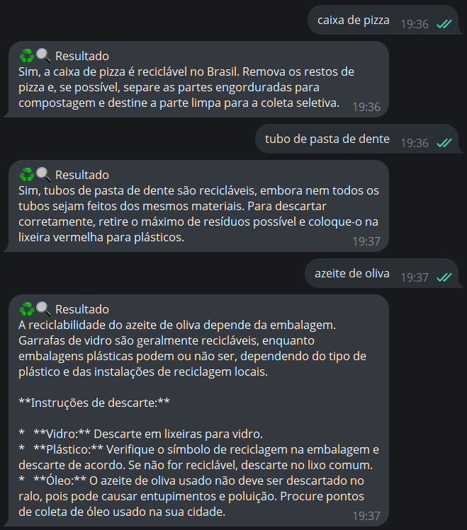

# ♻️ Bot de Reciclagem com IA: Agente Inteligente via Gemini + Telegram

Este repositório documenta o desenvolvimento de um projeto criado durante a **Imersão IA da Alura + Google Gemini**, inspirado pela minha relação pessoal com a sustentabilidade e a reciclagem.

## Minha Motivação

Sempre tive um forte interesse por **sustentabilidade** e a importância da **reciclagem consciente**. Desde cedo, me deparei com situações em que não sabia se determinado item era reciclável ou não — como uma caixa de pizza engordurada ou uma escova de dentes usada. Essas dúvidas são comuns e podem levar ao descarte incorreto de resíduos, o que prejudica todo o processo de reciclagem.

Pensando nisso, decidi desenvolver uma solução prática e acessível: um **bot que responde, de forma clara e confiável, se um item é reciclável e como descartá-lo corretamente**. A ideia era torná-lo fácil de usar — integrado ao Telegram — para que qualquer pessoa pudesse acessá-lo em poucos segundos.

## Sobre o Projeto

Durante a Imersão IA da Alura, que ocorreu entre os dias 12 e 16 de maio de 2025, aprendi a utilizar o Google Gemini e o ADK para construir agentes de IA e bots inteligentes. A partir dos aprendizados, desenvolvi este sistema com dois agentes:

* Um **agente principal**, que usa o Gemini com Google Search para identificar se um item é reciclável;
* Um **agente validador**, que revisa e refina a resposta, garantindo clareza, correção e aplicabilidade no Brasil.

Esses agentes foram integrados a um **bot do Telegram**, que permite que qualquer pessoa envie uma pergunta como:

> "Lata de desodorante pode ser reciclada?"

E receba a resposta correta, já validada e formatada.

## Tecnologias e Ferramentas Utilizadas

* **Google Gemini API** para análise e geração de respostas inteligentes
* **Google ADK** para criação dos agentes
* **Python 3.11+** com `asyncio`
* **Telegram Bot API** com a biblioteca `python-telegram-bot`
* Ambiente local no **VS Code**, com `requirements.txt` e `.env`

## Estrutura do Projeto

📁 Arquivos principais:

* `agente_pergunta_reciclavel.py`: contém os agentes Gemini (reciclador e validador)
* `bot_pergunta_reciclavel.py`: integra o bot do Telegram com os agentes

## Como Usar

1. Clone o repositório
2. Crie um bot no Telegram via [@BotFather](https://t.me/BotFather)
3. Defina sua chave da API Gemini no `.env`
4. Instale as dependências com `pip install -r requirements.txt`
5. Execute com `python bot_pergunta_reciclavel.py`

## Exemplo de Uso

No exemplo abaixo, você pode visualizar uma interação real com o bot de reciclagem no Telegram. A imagem foi capturada durante testes e mostra como o usuário envia uma pergunta e recebe uma resposta validada pela IA:

  

## Conclusão

Este projeto representa a aplicação prática do que aprendi durante a Imersão IA, mas, mais do que isso, é a concretização de uma ideia que me acompanha há muito tempo. Criar um assistente que possa ajudar as pessoas a reciclar corretamente, com base em dados confiáveis e linguagem acessível, é uma forma de contribuir para hábitos mais sustentáveis no dia a dia. Também tenho o desejo de colocar o bot no ar de forma pública, acessível a qualquer pessoa, para que ele possa ajudar ainda mais gente a fazer escolhas conscientes.

Espero expandir essa iniciativa futuramente para aceitar imagens, identificar localizações de pontos de coleta, e integrar com calendários de coleta seletiva.

---

💚 Projeto criado com propósito: porque uma dúvida simples sobre reciclagem também pode ser resolvida com inteligência artificial.

---

📚 Referências:

* [https://www.alura.com.br/imersao-ia](https://www.alura.com.br/imersao-ia)
* [https://www.alura.com.br/artigos/imersao-ia](https://www.alura.com.br/artigos/imersao-ia)
* [https://imersaoia.alura.com.br/](https://imersaoia.alura.com.br/)
* [https://core.telegram.org/bots/tutorial](https://core.telegram.org/bots/tutorial)
* [https://google.github.io/adk-docs/](https://google.github.io/adk-docs/)

## Contato

Se quiser conversar sobre o projeto, dar sugestões ou colaborar, entre em contato:

- 💼 [LinkedIn](https://www.linkedin.com/in/santiagonat/)
- 📧 E-mail: [nataliasantiago2@gmail.com](mailto:nataliasantiago2@gmail.com)

